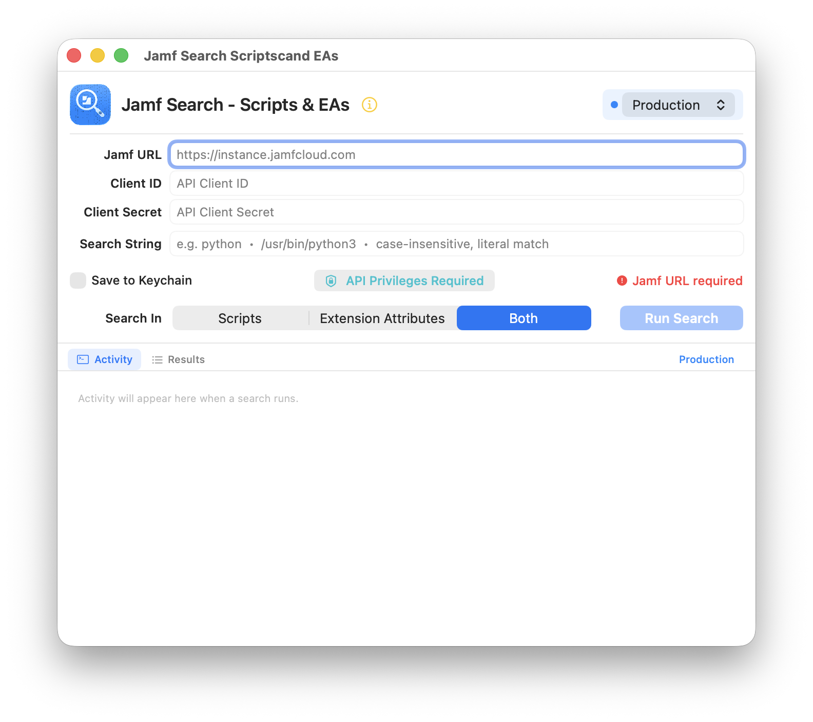
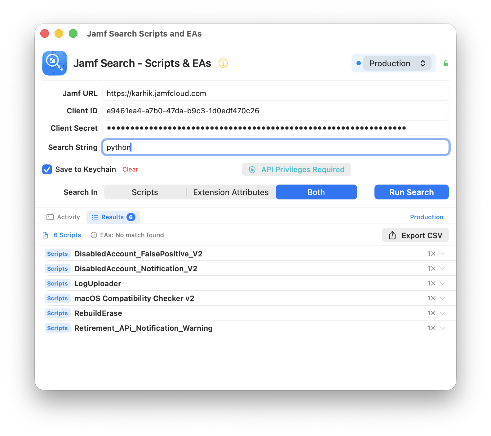

# Jamf Search - Scripts & EAs

Search text across all Scripts and Computer Extension Attributes in your Jamf Pro instance.

[](https://www.apple.com/macos/)
[](https://swift.org/)
[](https://developer.apple.com/xcode/swiftui/)
[](LICENSE)
[](https://developer.apple.com/support/code-signing/)
[](https://developer.apple.com/documentation/security/notarizing_macos_software_before_distribution)

---

## 📖 Overview

**Jamf Search - Scripts & EAs** is a search tool designed for Jamf Pro administrators who need to quickly locate scripts and extension attributes containing specific strings, commands, or code patterns. Whether you're auditing your environment, tracking down deprecated commands, or finding which scripts use a particular binary, this tool makes it fast and easy.

**Use cases:** Audit deprecated commands, find scripts using specific binaries, locate hardcoded paths, track down specific code patterns.

### Key Features

- 🔍 **Fast Text Search** - Case-insensitive literal string matching across all scripts and EAs
- 🎯 **Flexible Scope** - Search Scripts only, Extension Attributes only, or both simultaneously
- 🔐 **Secure Authentication** - OAuth 2.0 with automatic token revocation after each search
- 💾 **Credential Management** - Secure Keychain storage with per-environment isolation
- 🌍 **Multi-Environment** - Switch between Production and Sandbox instances seamlessly
- 📊 **Detailed Results** - View matching resources with line numbers and match counts
- 📤 **CSV Export** - Export results with full metadata for reporting and analysis
- 📝 **Activity Logging** - Real-time search progress with copyable activity logs
- 🎨 **Native macOS UI** - Built with SwiftUI for a modern, responsive experience
- ✅ **Signed & Notarized** - Code-signed with Apple Developer ID and notarized for Gatekeeper approval

---
## Screenshots



---

## Installation

#### Option 1: Download Pre-Built App (Recommended)

1. Download the latest release from [Releases](../../releases)
2. Unzip the downloaded file
3. Move `Jamf Search Scripts and EAs.app` to your Applications folder
4. **First launch:** Double-click to open
   - The app is **code-signed and notarized by Apple**
   - No "unidentified developer" warnings
   - Opens immediately without security prompts

> ✅ **Security:** This app is signed with an Apple Developer ID certificate and notarized by Apple, meaning it has been scanned for malware and approved for distribution outside the Mac App Store.

---

## Setup

#### Creating API Client in Jamf Pro

1. Log in to **Jamf Pro** with administrator privileges
2. Navigate to **Settings** → **System** → **API Roles and Clients**
3. Click the **API Clients** tab
4. Click **+ New**
5. Configure the client:
   - **Display Name**: `Jamf Search Tool` (or any name you prefer)
   - **Enabled**: ✓ Checked
   - **Access Token Lifetime**: 30 minutes (default, recommended)
   - **Client ID**: Auto-generated (copy this)
   - **Client Secret**: Auto-generated ⚠️ **Copy immediately - shown only once!**
6. Assign an **API Role**:
   - Select an existing role with required privileges, OR
   - Create a new role with these minimum privileges:
     - ✅ **Read Scripts**
     - ✅ **Read Computer Extension Attributes**
7. Click **Save**

> ⚠️ **Important:** The Client Secret is displayed only once during creation. Save it securely!
---
### 2. Configure App

1. Launch app
2. Select **Production** or **Sandbox**
3. Enter:
   - Jamf URL: `https://yourinstance.jamfcloud.com`
   - Client ID & Secret from Jamf Pro
4. Enable **Save to Keychain** (optional)

### 3. Search

- Enter search term: `python`, `/usr/bin/python3`, `curl`, etc.
- Select scope: Scripts, EAs, or Both
- Click **Run Search** or press Return

---

## Security

- **App Sandbox** - Restricted system access
- **Signed & Notarized** - Verified by Apple (no malware)
- **OAuth 2.0** - No passwords stored, tokens revoked after use
- **Keychain Encryption** - Credentials encrypted by macOS
- **Zero Telemetry** - No tracking or analytics

**Verify signature:**
```bash
codesign -dv "Jamf Search Scripts and EAs.app"
spctl -a -v "Jamf Search Scripts and EAs.app"
```

---

## Troubleshooting

**Authentication fails?**
- Check Client ID/Secret in Jamf Pro
- Verify API Role has Read Scripts + Read Computer EAs

**Access denied?**
- API Role missing required permissions

**Credentials won't save?**
- Unlock Keychain in Keychain Access app
- Or skip "Save to Keychain" (works for current session)

**More help:** Check Activity tab for detailed errors or [open an issue](../../issues)

---

## Building from Source

```bash
git clone https://github.com/karthikeyan-mac/JamfScriptsEAsStringSearch.git
cd JamfScriptsEAsStringSearch
open JamfScriptsEAsStringSearch.xcodeproj
```
---
## 🙏 Acknowledgments

- **Apple** - [SwiftUI](https://developer.apple.com/xcode/swiftui/) framework
- **Jamf** - [Jamf Pro API](https://developer.jamf.com/) documentation
- **Jamf Community** - Feedback and feature requests
- **macOS admins** - Testing and real-world usage
- **AI** - (ChatGPT & Claude)
---
## License

MIT License - Free to use, modify, and distribute.

---

## Links

- [Report Issues](../../issues)
- [Request Features](../../discussions)
- [Security Review](SECURITY_REVIEW.md)

---

**Jamf Search - Scripts & EAs** is not affiliated with, endorsed by, or sponsored by Jamf Software LLC.
Jamf and Jamf Pro are trademarks of Jamf Software LLC.

---
⭐ Star if useful • [Report Bug](../../issues) • [Request Feature](../../discussions)
